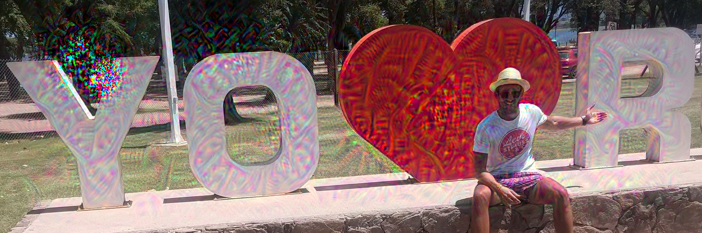
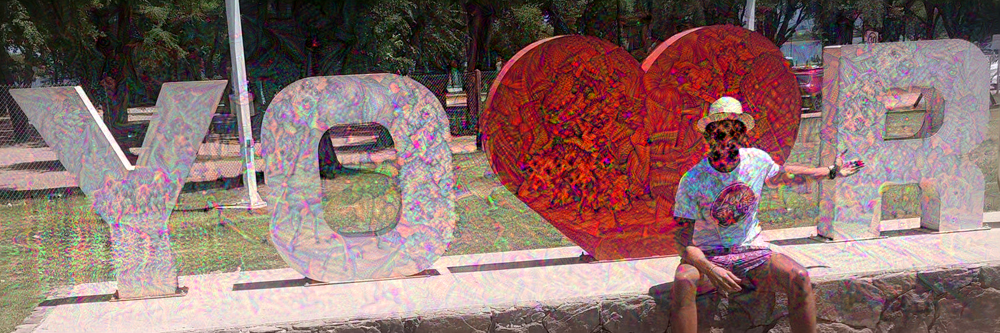

```{r setup, include=FALSE}
library("knitr")
knitr::opts_chunk$set(echo = TRUE)
knitr::opts_chunk$set(fig.align = "center")
```

_Remember DeepDream? Yes, the Deep Neural Network (NN) that transformed pictures by adding psychedelic "dream" effects. If not, take a look at [Wikipedia's article](https://en.wikipedia.org/wiki/DeepDream)._

```{r deepdream_example, echo=FALSE}
include_graphics(
  "https://upload.wikimedia.org/wikipedia/commons/thumb/6/65/Aurelia-aurita-3-0049.jpg/320px-Aurelia-aurita-3-0049.jpg"
)
```

## Non-technical DeepDream's TL;DR

DeepDream uses a deep convolutional network, named ["Inception"](https://paperswithcode.com/method/inception-v3), which was trained with the aim of automatically classifying images. DeepDream author Alexander Mordvintsev wanted to know what calculations/transformations the model was performing on the input image when trying to classify it.

Inception's NN architecture contains ten independent _concatenate_ layers ("Concat"; red boxes in the following figure). By editing the weights of different layers, after giving an input image, we could visually check the transformation effect of each layer. To Alexander's surprise, the results were astonishing, finding artistic psychedelic alterations in the images.

```{r inception_architecture, echo=FALSE, fig.cap="The architecture of the Inception neural network."}
include_graphics(
  "https://paperswithcode.com/media/methods/inceptionv3onc--oview_vjAbOfw.png"
)
```

Inception was trained with a large number of images, however, there was a predominance of animal images. And that is why in the dreams generated by DeepDream, it is common for effects related to animals to appear. This is where my interest arises to think "what will happen if we retrain Inception's architecture with images of cannabis?" 🤯.

## Retraining the Architecture

For this project, the NN architecture of Inception was trained from scratch so that it classifies cannabis images within four sub-categories. A total of 2822 images were used, tagged as "flower" 💐 (2243 images), "plant" 🌱 (90), "pre-roll" 🚬 (257), and "seeds" 🌰 (232), as exemplified by the following images respectively:

```{r example_imgs_1, echo=FALSE, fig.cap='Example images for category "flower" and "plant".', fig.align='default'}
# https://commons.wikimedia.org/wiki/File:Orange_Cookies.png
include_graphics(
  "https://upload.wikimedia.org/wikipedia/commons/thumb/8/85/Orange_Cookies.png/320px-Orange_Cookies.png"
)
# https://commons.wikimedia.org/wiki/File:Marijuana_plant.jpg
include_graphics(
  "https://upload.wikimedia.org/wikipedia/commons/thumb/1/17/Marijuana_plant.jpg/180px-Marijuana_plant.jpg"
)
```

```{r example_imgs_2, echo=FALSE, fig.cap='Example images for category "pre-roll" and "seeds".', fig.align='default'}
# https://commons.wikimedia.org/wiki/File:Marijuana_pre-roll.jpg
include_graphics(
  "https://upload.wikimedia.org/wikipedia/commons/thumb/e/ed/Marijuana_pre-roll.jpg/320px-Marijuana_pre-roll.jpg"
)
# https://commons.wikimedia.org/wiki/File:Hempseed.jpg
include_graphics(
  "https://upload.wikimedia.org/wikipedia/commons/thumb/5/57/Hempseed.jpg/320px-Hempseed.jpg"
)
```


## Analyzing Each Layer Individually

Once the model, called "WeedCeption_v1" was trained, a procedure similar to that developed in DeepDream was followed. In this first stage, to analyze the contributions of each _concatenate_ layer, on each iteration only one weight (from 1 to 10) for one layer was taken into account. Starting from the original image, the images generated automatically by the model were obtained after using each layer and weight. Next, for each layer, the image generated by one of the evaluated weights (representative weight was chosen by me) is shown.

This is the original input image given to the WeedCeption_v1 trained model:

```{r echo=FALSE}
include_graphics("../original_img.jpg")
```

Analyzing the effects of layer 1, there are no clear patterns related to the 4 categories used for training. With some creativity, some flower-like textures can be appreciated.

```{r echo=FALSE, fig.cap="WeedCeption_v1 concatenate layer 1 (weight=7) effects."}

```

Now, in layers 2 and 3, more marked patterns begin to be noticed. Flower textures are more recognizable, as well as seed-like figures begin to appear. Also, some elongated figures appear, which could have some relation to pre-rolls.

```{r echo=FALSE, fig.cap="WeedCeption_v1 concatenate layer 2 (weight=10) effects."}

```

```{r echo=FALSE, fig.cap="WeedCeption_v1 concatenate layer 3 (weight=7) effects."}
include_graphics("../LayersImgs/mixed3_7.0.png")
```

Layer 4 does not present easily recognizable patterns, it could be interpreted that figures related to pre-rolls or plants influence this layer.

```{r echo=FALSE, fig.cap="WeedCeption_v1 concatenate layer 4 (weight=10) effects."}
include_graphics("../LayersImgs/mixed4_10.0.png")
```

In layer 5, again no noticeable patterns are observed, although a few seed-related figures can be seen.

```{r echo=FALSE, fig.cap="WeedCeption_v1 concatenate layer 5 (weight=2) effects."}

```

Layer 6 presents well-marked patterns of flower textures, especially when looking at the image of the red heart.

```{r echo=FALSE, fig.cap="WeedCeption_v1 concatenate layer 6 (weight=3) effects."}

```

In layers 7 and 8, no easily recognizable patterns can be seen. Although some quite interesting psychedelic effects are created.

```{r echo=FALSE, fig.cap="WeedCeption_v1 concatenate layer 7 (weight=3) effects."}
include_graphics("../LayersImgs/mixed7_3.0.png")
```

```{r echo=FALSE, fig.cap="WeedCeption_v1 concatenate layer 8 (weight=7) effects."}
include_graphics("../LayersImgs/mixed8_7.0.png")
```

Finally, in layers 9 and 10, some beautiful flower textures are present.

```{r echo=FALSE, fig.cap="WeedCeption_v1 concatenate layer 9 (weight=3) effects."}
include_graphics("../LayersImgs/mixed9_3.0.png")
```

```{r echo=FALSE, fig.cap="WeedCeption_v1 concatenate layer 10 (weight=3) effects."}

```

<!-- # 1   maybe flower -->
<!-- # 2   seed / flower -->
<!-- # 3   seed / flower / preroll shapes -->
<!-- # 4   preroll shapes / plant shapes -->
<!-- # 5   maybe seed -->
<!-- # 6   super flower -->
<!-- # 7   psyco -->
<!-- # 8   psyco -->
<!-- # 9   nice flower -->
<!-- # 10  nice flower -->

Do you see something else of the layers that I have not observed? Please comment below 👇!

## Using Selected Layers for Final Result

Having analyzed the individual effects of each layer, I selected the layers with which I would like to analyze interactions. The selected layers were layer 2 (seed/flower-like effects), 6 (super flower effects), and 9 (nice flower effects). For this combination of layers, analyzing random selections of weights, new transformations of the original image were obtained. Next, I present what I consider the most beautiful output image obtained. This image was obtained with weights `2`, `5`, and `4`, for layers 2, 6, and 9 respectively.

```{r echo=FALSE, fig.cap="Final WeedDream obtained image."}
include_graphics("../NiceDreams/mixed2_2.0_mixed6_5.0_mixed9_4.0.png")
```

We can observe the beautiful cannabis-related effects that WeedDream is able to add to the original image. Easily differentiable flower textures can be observed, as well as some seeds tend to appear.

Would you like to get your picture WeedDreamed? Comment on this post, and I will try to get the job done 🦾!

## Next Steps

As previously mentioned, DeepDream tends to add animal figures, since it was trained with an unbalanced amount of images for animals. In WeedDream something similar happens, since the number of flower images is times greater than the rest, flowers is the most distinguishable effect obtained. Retraining the model with a larger number of images, towards obtaining WeedCeption_v2, would definitely result in a more interesting analysis. Maybe Weedmaps or Leafly can help by allowing me to use their gigantic image database 😅🙏.

## Reproducibility

All the work presented in this post can be easily replicated. The full code is available on [GitHub](https://github.com/jcrodriguez1989/weeddream/). However, the images used for training are not mine, so I cannot include them in the repository.

## Acknowledgments

I thank [Nicolas Peretti](https://github.com/nicoperetti), my trusted expert in Deep Learning, for the discussion and exchange of ideas.
